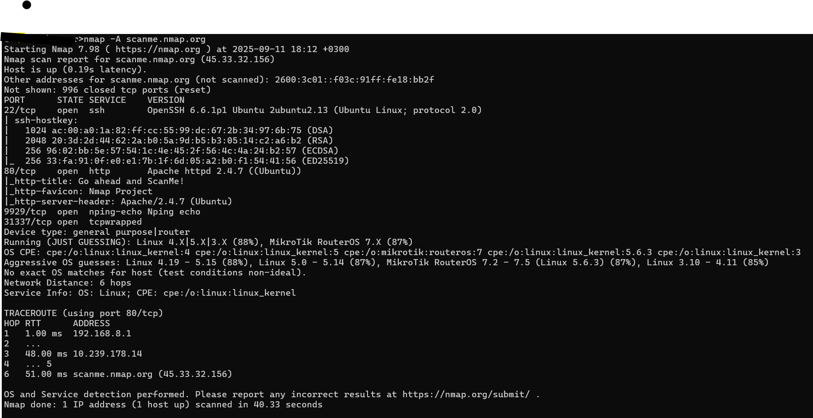
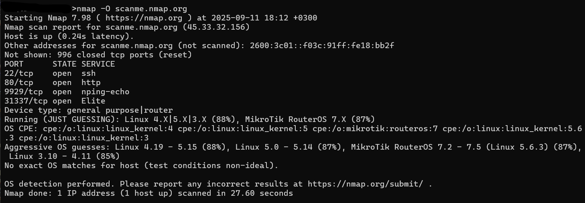
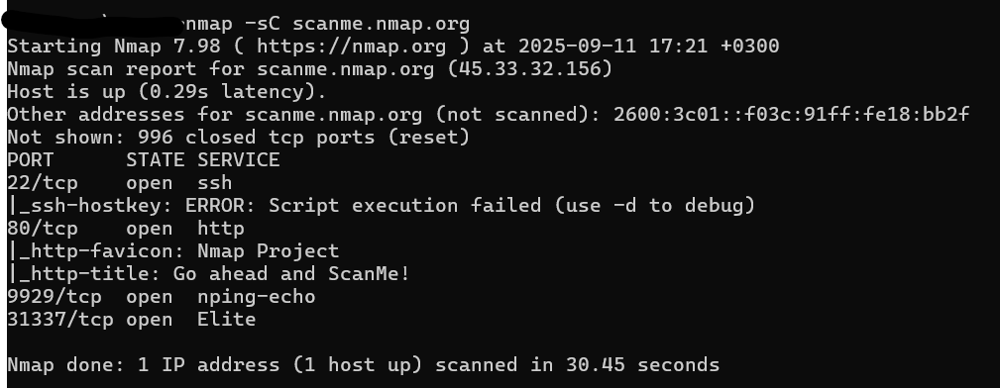
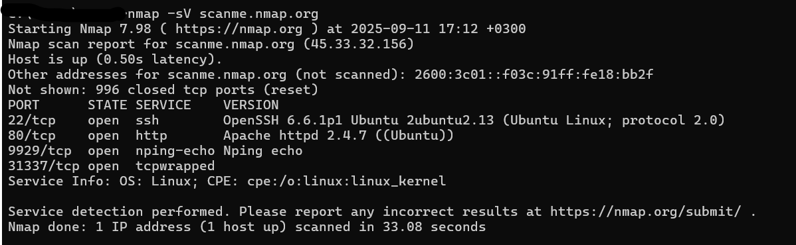
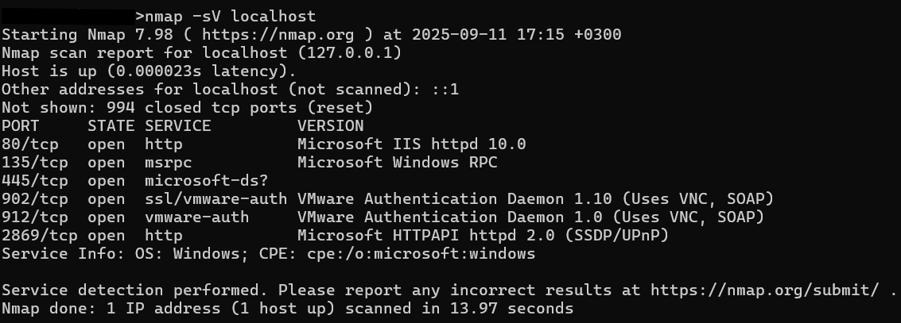

# Nmap Lab

## Overview
This lab contains different Nmap scans on legal targets (`scanme.nmap.org`) and localhost.  
It demonstrates aggressive scanning, OS detection, service/version detection, and NSE script execution.

## Tools
- Kali Linux
- Zenmap (GUI)
- Nmap CLI

## Scans

### 1. Aggressive Scan
Command: `nmap -A scanme.nmap.org`  

### 2. OS Detection Scan
Command: `nmap -O scanme.nmap.org`  

### 3. NSE Script Scan
Command: `nmap -sC scanme.nmap.org`  

### 4. Service & Version Scan (Remote)
Command: `nmap -sV scanme.nmap.org`  

### 5. Service & Version Scan (Localhost)
Command: `nmap -sV localhost`  

